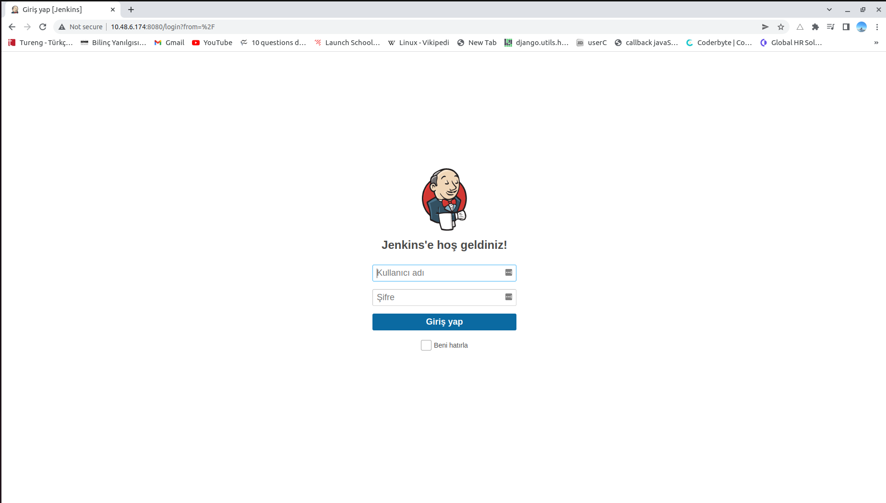

<div id="top"></div>
<!--
*** Thanks for checking out the Best-README-Template. If you have a suggestion
*** that would make this better, please fork the repo and create a pull request
*** or simply open an issue with the tag "enhancement".
*** Don't forget to give the project a star!
*** Thanks again! Now go create something AMAZING! :D
-->


<!-- PROJECT SHIELDS -->
<!--
*** I'm using markdown "reference style" links for readability.
*** Reference links are enclosed in brackets [ ] instead of parentheses ( ).
*** See the bottom of this document for the declaration of the reference variables
*** for contributors-url, forks-url, etc. This is an optional, concise syntax you may use.
*** https://www.markdownguide.org/basic-syntax/#reference-style-links
-->


<!-- PROJECT LOGO -->
<br />
<div align="center">
  

  <h3 align="center">DevOps Case</h3>

 
</div>


<!-- TABLE OF CONTENTS -->
  <summary>Table of Contents</summary>
  <ol>
    <li>
      <a href="#about-the-project">About The Project</a>
      <ul>
        <li><a href="#tools">Tools</a></li>
        <li><a href="#why-i-used-multipass-instead-virtualbox">Why I used Multipass instead VirtualBox?</a></li>
      </ul>
    </li>
    <li>
      <a href="#installation-multipass-and-launch-servers">Installation Multipass and Launch Servers</a>
    </li>
    <li><a href="#installation-kubernetes-on-server1-and-server2">Installation Kubernetes on server1 and server2</a></li>
    <li><a href="installation-jenkins-docker-and-docker-registry-on-server3">Installation Jenkins, Docker and Docker Registry on server3</a></li>
    <li><a href="#contact">Contact</a></li>
    
  </ol>


<!-- ABOUT THE PROJECT -->
## About The Project


1. Install virtualbox in your local PC.
2. Create 3 VM with any linux operation system in virtualbox.
3. Kubernetes cluster Installation with 1 master and 1 node (You can use the Server-1 and Server-2)
4. Jenkins installation in Server-3
5. Docker registry installation in Server-3
6. Jenkins pipeline project description:
 <br> a.Create an application image with Dockerfile. (Expected to serve "Hello World" in browser. Free of Language (Python dJango, Node Js etc..)
	<br>b.Push the step a docker image to docker registry which you installed Server -3.
	<br>c.Deploy this docker image to kubernetes cluster.
	<br>d.Perform all step operations a-b-c in jenkinsfile

<p align="right">(<a href="#top">back to top</a>)</p>


### Tools


* [Multipass](https://multipass.run/)
* [Kubernetes](https://kubernetes.io/docs/home/)
* [Docker](https://docs.docker.com/)
* [Jenkins](https://www.jenkins.io/doc/)


<p align="right">(<a href="#top">back to top</a>)</p>

### Why I used Multipass instead VirtualBox?
  
  My laptop crashed every time I created  virtual machines and virtual machines never worked correctly and I got different kernel errors. I spent days to figured it out what is the problem and how can I fix them but I could not any clean way then I realized I don't have much time and I didn't want to waste my time for these unclear and complex errors. That is why I used Multipass.

Multipass is a tool to generate cloud-style Ubuntu VMs quickly on Linux, macOS, and Windows. You can check [documentation](https://multipass.run/docs) for more info

<!-- Installation Multipass and Launch Servers -->
## Installation Multipass and Launch Servers


1. [Multipass](https://multipass.run/)

2. Install Multipass on Linux
   ```
    sudo snap install multipass
   ```
3. Launch LTS instances with 2 CPU, 2G memory and 10G space
   ```
    multipass launch --name server1 -c 2 -m 2G -d 10G
    multipass launch --name server2 -c 2 -m 2G -d 10G
    multipass launch --name server3 -c 2 -m 2G -d 10G
    
   ```
4. Connect to instances
   ```
    multipass shell [instances_name]
	```
<p></p>		

<p align="right">(<a href="#top">back to top</a>)</p>


<!-- USAGE EXAMPLES -->
## Installation Kubernetes on server1 and server2

I followed steps on this [website](https://computingforgeeks.com/deploy-kubernetes-cluster-on-ubuntu-with-kubeadm/) to install Kubernetes and create cluster on server1 and server2
<p></p>
<br>
<p align="right">(<a href="#top">back to top</a>)</p>


<!-- ROADMAP -->
## Installation Jenkins, Docker and Docker Registry on server3

1. I followed Jenkins [documentation](https://www.jenkins.io/doc/book/installing/linux/) to installation of Jenkins
<p></p><br>

2. I followed Docker [documentation](https://docs.docker.com/engine/install/ubuntu/) to installation of Docker
  <p></p><br>

3. I followed Docker [documentation](https://docs.docker.com/registry/) to installation of Docker Registry
  <p></p><br>
 
   


<p align="right">(<a href="#top">back to top</a>)</p>


<!-- CONTACT -->
## Contact

Fahrettin Orkun İncili - [@linkedin](https://www.linkedin.com/in/orkunincili/) - orkunincili0@gmail.com


<p align="right">(<a href="#top">back to top</a>)</p>


<!-- MARKDOWN LINKS & IMAGES -->
<!-- https://www.markdownguide.org/basic-syntax/#reference-style-links -->
[contributors-shield]: https://img.shields.io/github/contributors/othneildrew/Best-README-Template.svg?style=for-the-badge
[contributors-url]: https://github.com/othneildrew/Best-README-Template/graphs/contributors
[forks-shield]: https://img.shields.io/github/forks/othneildrew/Best-README-Template.svg?style=for-the-badge
[forks-url]: https://github.com/othneildrew/Best-README-Template/network/members
[stars-shield]: https://img.shields.io/github/stars/othneildrew/Best-README-Template.svg?style=for-the-badge
[stars-url]: https://github.com/othneildrew/Best-README-Template/stargazers
[issues-shield]: https://img.shields.io/github/issues/othneildrew/Best-README-Template.svg?style=for-the-badge
[issues-url]: https://github.com/othneildrew/Best-README-Template/issues
[license-shield]: https://img.shields.io/github/license/othneildrew/Best-README-Template.svg?style=for-the-badge
[license-url]: https://github.com/othneildrew/Best-README-Template/blob/master/LICENSE.txt
[linkedin-shield]: https://img.shields.io/badge/-LinkedIn-black.svg?style=for-the-badge&logo=linkedin&colorB=555
[linkedin-url]: https://linkedin.com/in/othneildrew
[product-screenshot]: images/screenshot.png
